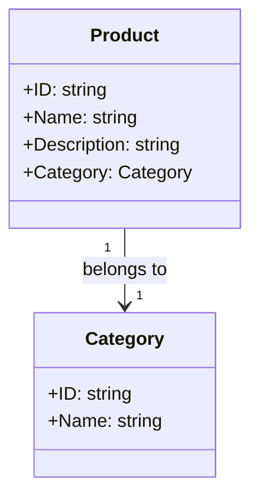

# go-backend-lambda

```mermaid
classDiagram
    class Product {
        +ID: string
        +Name: string
        +Description: string
        +Category: Category
    }

    class Category {
        +ID: string
        +Name: string
    }

    Product "1" --> "1" Category: belongs to
```